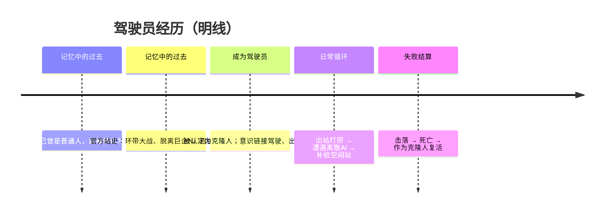

# 明线 · 时间线（驾驶员经历）

> 驾驶员记得的过去与正在经历的现在。背景真相见 [暗线·时间线](../02-暗线/暗线·时间线.md)。待定项见 [待定项汇总](../00-总览/待定项汇总.md)。

---

## 概览

## 事件表

| 阶段 | 经历 | 状态 |
|------|------|------|
| 过去 | 自认「本是人类 → 转化为克隆人」 | 已确认（情形待定） |
| 过去 | 官方站史：大战、受损脱离巨企N、自由政府建立 | 已确认（口径待定） |
| 过去 | 社会凭来源记录 + 身份识别认定克隆人 | 已确认 |
| 战前传闻 | A 站前身是服务采冰站的中转空间站 | 已确认 |
| 现在 | 以克隆人身份生活，次等、受异样目光 | 已确认 |
| 现在 | 意识链接驾驶智能载具，出站打捞 | 已确认 |
| 日常 | 废墟打捞；能源供站、燃料供载具；遇离散AI | 已确认 |
| 循环 | 击落 → 死亡 → 克隆复活（意识回传） | 已确认（继承债务待定） |

词条：[驾驶员](驾驶员/驾驶员.md) · [智能载具](出站作业/智能载具.md) · [资源系统](出站作业/资源系统.md) · [环带](出站作业/环带.md) · [离散AI](出站作业/离散AI.md) · [自由政府](站内社会/自由政府.md) · [学社](站内社会/学社.md) · [共信会](站内社会/共信会.md) · [A站遇袭](站内社会/A站遇袭.md)

---

**分类：** 时间线 | 明线
**状态：** 随决议更新
