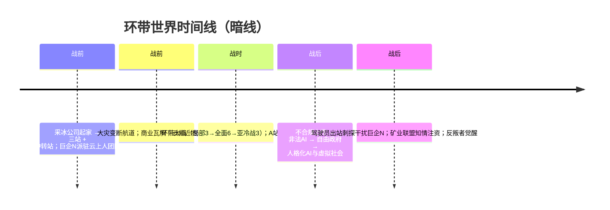

# 暗线 · 时间线（背景与真相）

> 真实事件链。驾驶员经历见 [明线·时间线](../01-明线/明线·时间线.md)。待定项见 [待定项汇总](../00-总览/待定项汇总.md)。

---

## 概览

## 绝对年份（大灾变＝0，距今约 20 年）

| 事件 | 灾变后 | 距今 |
|------|--------|------|
| 采冰起家 / 扩张与巨企N驻站 / 中转站建成 | — | 25+ / 22–25 / 21–22 年前 |
| 大灾变 | 0 | ~20 年前 |
| 大战爆发 / 全面战争 / A站受袭与封锁 | 2–3 / 5–6 / 11–12 | ~17–18 / 14–15 / 8–9 年前 |
| 上传逃难 / 亚冷战 / 大战最晚结束 | ~12 / 11–12 / 14–15 | ~8 / 8–9 / 5–6 年前 |
| 虚拟社会成型 / 现在 | 13–15 / ~20 | 5–7 年前 / 现在（运行约 5–8 年） |

各锚点可 ±2–3 年；若战争取满 12 年，整体可放宽至约 20–23 年。

## 战前

| 事件 | 状态 |
|------|------|
| 采冰公司一颗冰质小行星起家（约 1500–2000 人）→ 扩至三站；引入巨企N 技术与云上人驻站团队（后为学社）；失业原生人涌入为劳动力 | 已确认 |
| 第一站采尽改造为中转空间站（2000–3000 人）迁至三站中心 = A 站前身 | 已确认 |
| 大灾变断航道；采冰为环带内短途，未直接受冲击；商业模式瓦解；云邦近地派接管 | 已确认 |

## 战时

| 事件 | 状态 |
|------|------|
| 云邦武装接管要地 → 矿主抵抗 → 矿业联盟 → **环带大战**（6–12 年三阶段） | 已确认 |
| A 站全面战争末尾受袭、被动脱离巨企N；数月封锁，离港即沉 | 已确认（脱离具体事件待定） |

## 战后

| 事件 | 状态 |
|------|------|
| 维生不可修；封锁绝境中不合规上传（学社协助、授权断供）→ 非法人工智能 | 已确认 |
| 建自由政府；破禁令造人格化 AI；搭虚拟社会（成型数年，已运行 5–8 年） | 已确认 |
| 驾驶员出站：表象打捞，战略刺探干扰巨企N；矿业联盟知情注资（白手套） | 已确认 |
| 不知情长期维持（丙式）；反叛者 = 觉醒驾驶员（动机待定） | 已确认 |
| 巨企N 留用离散AI 护遗产；战场残留散兵/蛰伏/指挥官型基地 | 已确认 |

词条：[大灾变](01-战争/大灾变.md) · [环带大战](01-战争/环带大战.md) · [云邦](02-势力/云邦.md) · [矿业联盟](02-势力/矿业联盟.md) · [巨企N](02-势力/巨企N.md) · [无人站点](04-A站真相/无人站点.md) · [虚拟社会](04-A站真相/虚拟社会.md) · [自由政府](04-A站真相/自由政府（非法人工智能）.md) · [技术官僚](04-A站真相/技术官僚（受害者与施救者）.md) · [驾驶员](05-玩家真相/驾驶员（人格化人工智能）.md) · [反叛者](05-玩家真相/反叛者.md)

---

**分类：** 时间线 | 暗线
**状态：** 随决议更新
