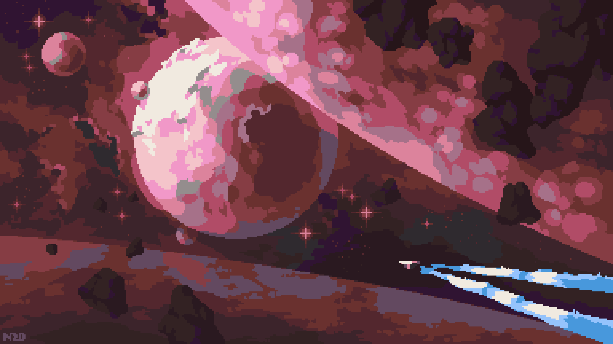
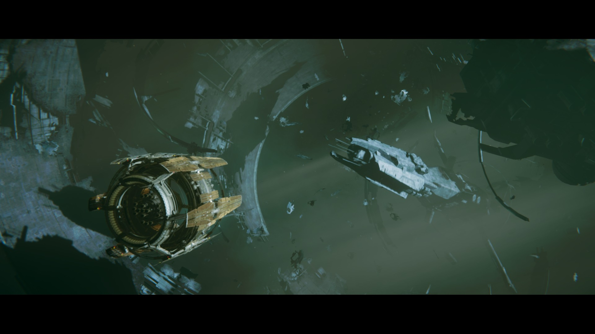

# 视觉基调与色彩体系

## 核心命题

Spaceship 的画面是**低饱和冷灰工业结构中的人工生命信号**。空间本身冷、暗、辽阔；人类制造的设施以黄白工作灯、少量红色告警和青色电子光证明自己仍在运转。宏观宇宙可出现蓝紫或粉紫色云气，但它们只承担远景情绪，不能取代局内空间的可读性。

## 颜色角色

| 颜色角色 | 视觉倾向 | 使用范围 | 限制 |
|---|---|---|---|
| 深空底色 | 近黑、深青灰、深蓝灰 | 背景、阴影、未照明区 | 保留层次，避免纯黑吞没轮廓 |
| 结构主色 | 蓝灰、石墨灰、失光冷白 | 船体、舱体、栈桥、设备外壳 | 大面积低饱和，以明度而非色相区分部件 |
| 工作光 | 偏暖黄白、淡琥珀 | 窗口、面板、地面导向、维护灯 | 用于定位和功能分区，不做满屏泛光 |
| 警示色 | 红橙、琥珀黄 | 故障、危险边界、关键状态 | 红色稀少且高对比；黄色优先于橙色作为常规提醒 |
| 电子与生命维持色 | 青蓝、低饱和荧光绿 | 屏幕、能量反馈、温室与生态区 | 绿色限定在生态/生存设施，禁止扩散为环境主色 |
| 宏观氛围色 | 紫蓝、粉紫、暗玫红 | 星云、遥远行星、叙事远景 | 不进入常规 UI 底色和近景工业材质 |

## 明度与光照

- **先分层，再上色。** 背景、结构、可交互物、告警信息必须有稳定的明度台阶；暗处可神秘，但不能让玩法对象与背景融为一体。
- **光源必须可追溯。** 舱窗、检修灯、屏幕、推进器和信标是有效光源；大面积无来源的彩色轮廓光不采用。
- **硬边优先。** 工业结构以清楚的明暗切面表现体积，辅以极少量柔光表达散射或空间尘埃。
- **冷暖分工。** 冷光描述空间和金属，暖光标记人类活动与操作位置；二者相遇时，暖光面积始终更小。

## 像素化与材质归纳

- 宏观背景参考使用块状渐变、有限色阶和断续星点，避免连续写实噪点。
- 金属材质用轮廓、切面、接缝、掉漆和局部反光区分，不依赖密集纹理。
- 一张画面中只保留一个最亮焦点和一至两个次级焦点；星云、屏幕和特效不能同时争夺最高亮度。

## 参考图解读

### 美术风格印象1.jpg

- **参考用途：** 深蓝、靛蓝与紫粉之间的有限色阶；中心亮星云作为远景焦点；粗颗粒像素笔触。
- **不可照搬：** 星云的浪漫、高亮和高占比不适合持续出现于局内背景。

### 美术风格印象2.jpg

- **参考用途：** 巨型天体压迫感；粉红天体与冷蓝航迹之间的冷暖对照；用大色块组织远近景。
- **不可照搬：** 粉色与白色高光只适用于特殊天象或叙事场景，不能成为工业世界的常态。

### 局内空间印象.jpg

- **参考用途：** 巨型环状残骸围出纵深，远近飞船建立尺度，微粒与碎片增强空间层次。
- **不可照搬：** 电影画幅黑边、过度压暗和无明确功能的绿色雾气不作为实际游戏画面标准。

## 执行检查

1. 画面缩小后，玩家是否仍能一眼区分结构、可交互目标和危险？
2. 每一处高亮是否对应灯、屏幕、推进器或状态信息？
3. 是否将暖色、荧光绿或宏观紫粉限制在它们的功能范围内？

**分类：** 美术风格 · 视觉基调
**状态：** 执行规范
