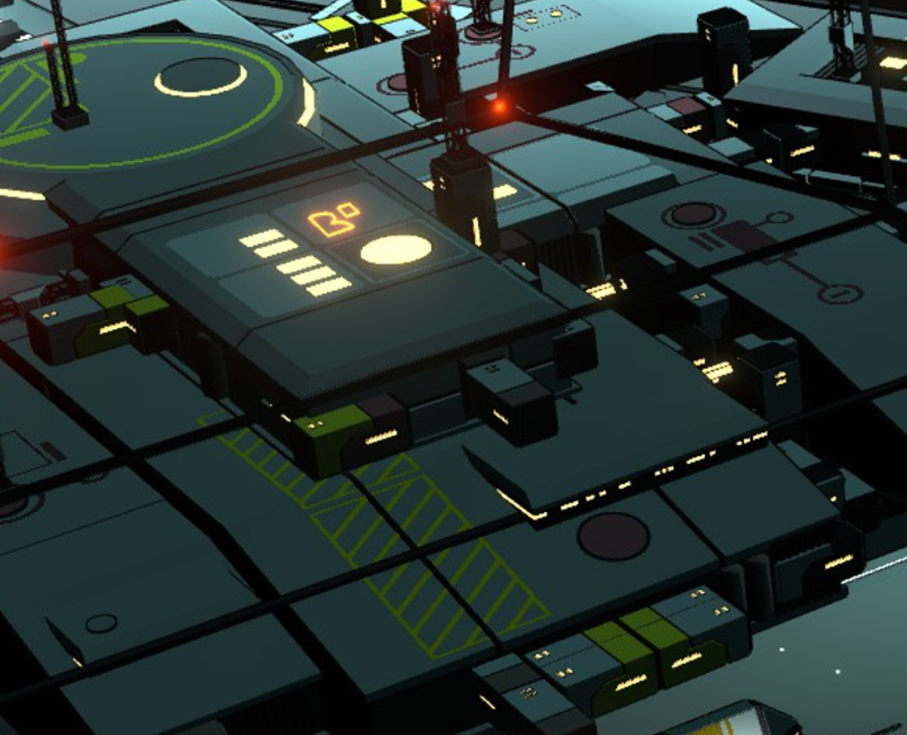
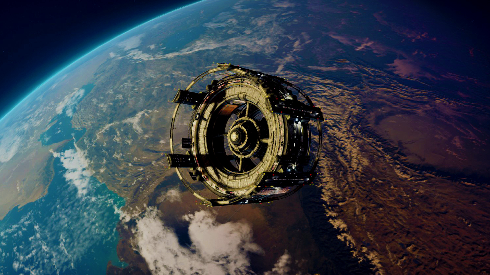
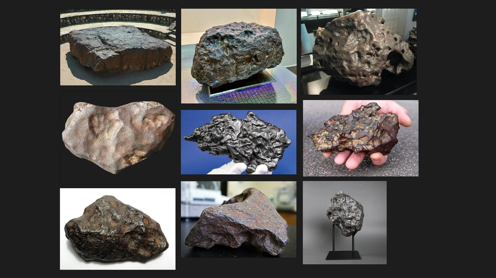

# 环境与场景风格

> 色彩、明度与照明总则见 [视觉基调与色彩体系](../00-总纲/视觉基调与色彩体系.md)。

## 场景总则

环境以“荒寂天体上的可维护工业设施”为主。建筑不是完整的城市天际线，而是可增建、可维修、可撤离的模块组合：厚重外壳抵御环境，桁架和栈桥连接功能区，灯光显示仍有人使用。

| 场景 | 首要感受 | 结构重点 | 光照重点 |
|---|---|---|---|
| 太空港 | 秩序、吞吐与规模 | 停泊坪、货运模块、管线、悬挂栈桥 | 黄白导向灯与少量红色信标 |
| 小行星据点 | 生存与临时扩建 | 岩面锚定、温室、外壳、维修通道 | 生命维持区可用低饱和荧光绿 |
| 小行星建筑 | 垂直设备与作业密度 | 塔架、平台、旋转或环形设施 | 白色工作灯与红色顶端警示灯 |
| 局内空间 | 压迫、纵深与未知 | 巨构残骸、断裂环、漂浮碎片 | 可玩区域保留明确的冷暖焦点 |

## 通用造型规则

- **硬边模块：** 以矩形舱段、斜切面、外露支撑与可见接缝组成主体；圆形仅用于舱口、旋转节点、雷达或压力容器。
- **功能分层：** 主体承重结构最厚重，外挂设备、线路和防护栏次之，标识和灯光最轻；不要用同样的细节密度填满所有表面。
- **路径可见：** 栈桥、边缘灯、门洞、管道走向和色带共同指向入口、任务点或危险区。
- **尺度锚点：** 每个大场景至少保留一个人类尺度物体，如舱门、座椅、扶手、作业灯或小型飞船。

## 参考图解读

### 太空港印象.png

- **提取：** 俯视可见的大型矩形平台、外露黑色连线、分散的设备盒、圆形着陆/操作区域，以及黄白灯与红灯的明确职能分工。
- **执行：** 港口采用“主平台 + 外挂功能模块 + 跨越栈桥”的层级；平台边缘和通道必须比装饰性设备更易读。

### 小行星上的人类据点.png

- **提取：** 厚重蓝灰外壳包围透明温室，内部绿光与外部冷暗形成对照；框架、梁柱和小型设备强调环境的人工属性。
- **执行：** 温室是稀有的“有生命”区域，允许绿色、柔和散射与较多内部细节；外壳仍保持硬边、低饱和和可维护的拼装感。

### 小行星上的建筑.png

- **提取：** 塔状设备、六边形顶盖、环形栈桥、白色灯带和红色航空警示灯共同组织垂直空间。
- **执行：** 垂直设施的顶部、作业层和基础层应有不同剪影；红灯只标记高度、边缘或危险，而不成为普通照明。

### 局内空间印象.jpg

- **提取：** 破损环形巨构形成天然取景框，前中后景都有船体或碎片，空间显得巨大且危险。
- **执行：** 局内空间可使用暗绿灰环境雾和漂浮物建立纵深，但交互物、弹道和导航目标必须拥有独立的明度或功能色。

## 反例：不用于局内背景

### 海报里的地球，不宜用作局内背景.jpg

写实地球、大气层弧光和完整空间站适合作为宣传海报的宏观奇观，但它们会占据过多画面、引入与本项目工业像素化不一致的写实信息，因此不用于局内背景。

### 海报里的太空美景，不宜用作局内背景.jpg

高饱和紫粉星环、强烈径向光和剪影飞船会降低目标与特效的辨识度，也偏离低饱和工业基调；仅保留为避免误用的色彩反例。

### 陨石？被大气层灼烧，参考价值低

此组图片以大气层灼烧和现实陨石题材为主，与本项目的深空工业场景及低饱和像素化语言无关。保留在图库中作题材边界记录，不引用到正式关卡或背景设计。

*后续会寻找其他参考替换*

**分类：** 美术风格 · 环境与场景
**状态：** 执行规范
