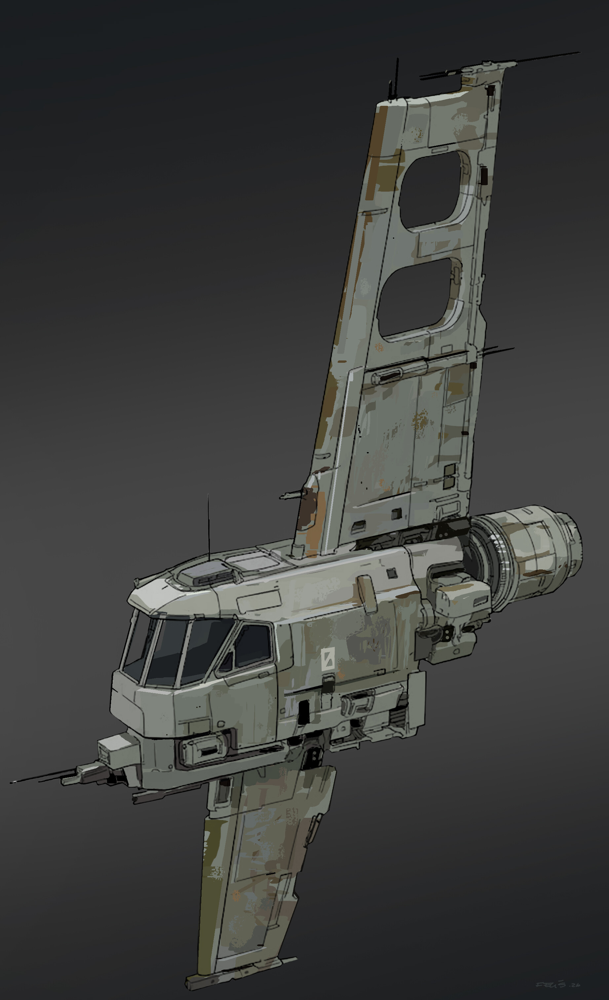

# 飞船与载具美术风格

> 色彩、明度与照明总则见 [视觉基调与色彩体系](../00-总纲/视觉基调与色彩体系.md)。

## 核心方向

飞船是可服役、可拆装、可维修的工业设备，不是光滑对称的幻想战机。玩家应能从外形读出驾驶舱、推进器、挂点和模块接口；即使停在远处，也能凭不对称轮廓、局部亮灯和功能色识别其用途。

## 造型规则

- **主体与模块：** 用一个明确的主体舱段承载驾驶、货运或核心系统，再外挂推进、武装、传感或储存模块。模块边界必须可见，并留出接缝、锁扣、线缆或支架。
- **非对称但平衡：** 允许天线、武器、维修舱和外挂设备造成局部不对称；整体重心、推进方向和驾驶舱朝向必须一眼明确。
- **硬边与厚度：** 主体以直线、斜面、矩形开孔和厚护板构成。舱门、窗框、翼根和推进器接口都应表现出实际厚度。
- **功能优先：** 每个大型轮廓变化都要对应功能：推进、散热、观察、装卸、停泊或防护。避免只为“科幻感”添加无意义鳍片。

## 材质、旧化与标识

| 元素 | 表现规则 |
|---|---|
| 基础涂装 | 冷灰、失光白或灰绿为主，使用大色块区分结构，不做镜面金属 |
| 磨损 | 集中在舱门边缘、挂点、推进器周围、维修口和常触碰区域；不要全舰均匀撒噪点 |
| 污渍与氧化 | 用于接缝、排气口、旧涂层边缘，面积小于基础涂装 |
| 标识 | 使用少量编号、方向箭头、危险条和势力记号；保证在远距离仍可读 |
| 灯光 | 按总纲颜色角色分配导航、警示与电子状态 |

## 细节密度

- **玩家常用载具：** 驾驶舱、模块接缝、操作口和识别标志必须明确；近看可读，远看保留干净轮廓。
- **大型背景载具：** 优先大结构、明显灯带和停泊接口；减少微小零件，避免与可交互船只争夺注意力。
- **拼装部件：** 接口尺寸、灯光颜色和标识位置应一致，让不同部件组合后仍像同一工业体系的产物。

## 参考图解读

### 驾驶员飞船材质、风格参考.jpg

- **提取：** 高而偏置的垂直翼、前置多窗驾驶舱、后置圆柱推进器和外挂小设备共同形成工具化的非对称轮廓；失光米白涂装以掉漆、污渍和接缝体现服役感。
- **执行：** 玩家飞船采用“驾驶舱—主体舱—推进模块”的清楚阅读顺序，局部护板和外挂件允许不对称；旧化只强调使用轨迹，不把整艘船做脏。
- **不采用：** 不直接复制原图的机翼比例、武器配置、窗形或具体结构布局。

## 交付检查

1. 仅看剪影能否判断飞船朝向、驾驶舱和推进端？
2. 拆分模块后，接口是否仍具有明确的机械连接逻辑？
3. 标识、灯光与磨损是否都服务于功能和使用历史？

**分类：** 美术风格 · 飞船与载具
**状态：** 执行规范
