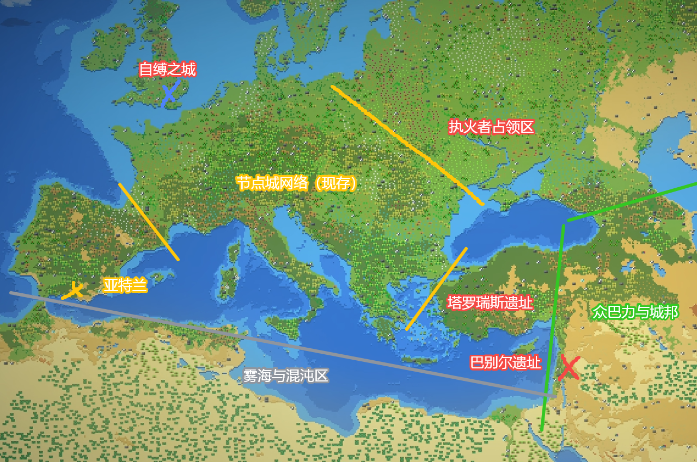
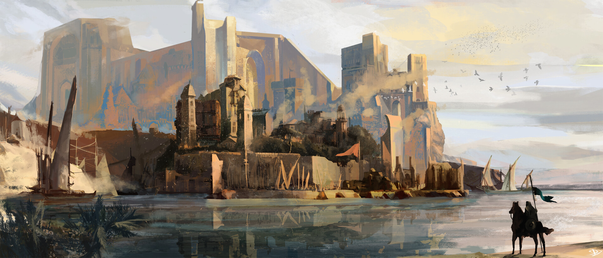

# 地面线事件时间图

## 概述

地面线描述了从前文明末期的贫富差距分化到壁垒协议制定，再到节点城建设，以及大天灾中节点城断联、城市体系与荒原聚落分化，最终到破晓时代荒原人击溃城市人的完整故事线。这条故事线展现了地面人类社会从阶级分化到“节点城内外层 + 荒原人群”并存结构，再到全面重组的过程。

---

## 故事地图（以塔罗瑞斯遗址为参照）

参考图：

以陷落的前文明巨城**塔罗瑞斯**遗址为中心参照：遗址**西北**为仍延续运作的**节点城网络**主体；**以东**为**荒原人**广泛分布的领土，其间夹着少数**边境节点城**或遗址（其中包括旋塔之城**巴别尔**）。

遗址**东北**方曾在历史上被**执火者**占领。遗址**正东至东南**为**巴力·哈达德**麾下**众城邦**的集中地带（居民整体人种风貌近似小亚细亚诸族）。

遗址**东南外海**为一片**雾海**：越往深处以太浸染越重，勘探与深入均极为困难。自节点城网络向西南沿海延伸的**半岛**上坐落着海潮派所建的**亚特兰**；沿该半岛海岸线**向东**行进可抵达哈达德诸城邦，沿途仅遇**零星边境节点城**，陆路压力相对低于节点城网络核心区。

### 气候与地貌分区（参考欧洲气候）

- **总体环流：** 受中纬西风带主导，西侧与西南沿海更湿润温和，向内陆与东部逐步转为大陆性；高纬地区冬季漫长并常受寒潮南下影响。
- **总体地势：** 西南海岸与半岛多低山-丘陵-潟湖体系；中部为连续平原与河网；东北与东部过渡到寒冷台地、针叶林与草原带；东南外海为异常以太海域（雾海）。

#### A. 西北—中部：节点城网络主体区（现存）

- **气候类型：** 海洋性气候向温带大陆性气候过渡（近似西欧—中欧过渡带）。
- **季节特征：** 冬季湿冷，极少出现极端低温；夏季温和至偏暖；四季分明，年降水量分布较为均匀。
- **地貌骨架：** 宽谷平原、低山丘陵与密集河网；适宜修建道路、运河及节点城之间的补给廊道。

#### B. 东部荒原带：荒原人广泛分布区（含边境节点城/遗址）

- **气候类型：** 温带大陆性气候至半干旱草原气候（近似东欧平原向内陆草原过渡带）。
- **季节特征：** 冬季更冷、更干，夏季更热，气温年较差显著；旱涝年际变化剧烈。
- **地貌骨架：** 黑土草原、风蚀台地、季节性河谷与盐碱洼地并存，局部出现大片次生荒漠化地表。

#### C. 东北执火者旧占领区：寒陆林地与离散以太高浓区

- **气候类型：** 寒温带大陆性气候/亚寒带南缘（近似东欧北段森林—草原交错带）。
- **季节特征：** 冬季严寒，积雪期长；春秋季短促；冻融循环强烈，沼泽季节明显。
- **地貌骨架：** 针阔混交林、冰碛丘陵、泥炭沼地与破碎的河湖系统。
- **以太特征：** 存在多处**离散型高浓度以太区**（“冷斑”与“亮斑”），常沿断裂带、古战场及旧节点设施残骸分布；单体规模普遍小于雾海，但对行军与定居的扰动更为随机。

#### D. 西南半岛：亚特兰及其滨海带

- **气候类型：** 以地中海气候为主，北段受海洋性气候调节（近似伊比利亚—亚平宁沿海复合带）。
- **季节特征：** 夏季炎热干燥，冬季温和多雨；海风稳定，近岸风暴呈季节性特征。
- **地貌骨架：** 石灰岩海岸、岬角与海湾密集；内陆多丘陵梯田与低山盆地，具备优良的天然深水港条件。

#### E. 正东至东南沿岸：哈达德众城邦带（小亚细亚人种）

- **气候类型：** 沿海属地中海气候，内陆高地过渡为大陆性干冷气候（近似安纳托利亚沿海—高原梯度）。
- **季节特征：** 沿海冬雨夏旱；内陆冬季寒冷多雪，夏季炎热干燥。
- **地貌骨架：** 海岸山脉与内陆高原并置，河谷冲积扇与山前平原形成“港城—山城—高原城”串联格局。

#### F. 东南外海：雾海与混沌过渡区

- **气候与海况：** 常年冷暖气团交汇，且气流与海流方向多不一致；低层逆温频繁出现，形成高湿、低能见度的海域。
- **以太特征：** 以太浸染呈现“连续高背景值 + 深处跃迁带”特征，越向深海越接近不可逆污染阈值；总体规模显著大于东北离散高浓区。
- **地貌表现：** 海上多见漂移雾墙、异常潮汐与不稳定涡旋；岸线多盐沼、黑沙滩及受侵蚀的断崖。

---

## 第一阶段：前文明末期

前文明末期，随着以太被发现并融入社会运行体系，贫富差距迅速扩大并固化为森严的阶层壁垒，不同阶层几乎生活在两个世界；为应对持续分化与潜在灾变，前文明统治体系制定壁垒协议，并依托轨道研究站所研发的以太壁垒技术启动节点城建设，逐步形成以节点城为核心的生存与治理结构；此时，伊勒（El）信仰已沿旧文明脉络绵延，并在节点城秩序中被制度化，成为政治合法性与教义正当性相互支撑的叙事基础。

---

## 第二阶段：大天灾（世界异变）

### 1. 节点城断联

- **事件：** 城市群被“大洪水”冲击，节点城断联，部分城市陷落（如塔罗瑞斯被大地吞入腹中）
- **说明：** 大天灾期间（潮涌期），节点城遭受异变冲击，与外界失去联系。部分城市陷落，幸存的节点城尝试重新建立链接（节点城之间能够相互锚定，以此稳定以太壁垒，并传递资源与信息，但大部分链接遭受洪水冲击后失效，需要修复）。

---

### 2. 以勒降临

- **事件：** 以勒“降临”于旋塔之城
- **说明：** 以勒在节点城之间的链接瘫痪期间“降临”于旋塔之城“巴别尔”，册封诸天使并在塔顶建立“花园”。

---

### 3. 路西法叛变

- **事件：** 路西法叛变并被放逐
- **说明：** 被册封为大天使长的主天使“路西法”妄图和以勒分权，与以勒并立，最终被米迦勒率众天使击败并放逐。路西法的追随者团体“执火派”转入暗中活动。
- **真相：** 路西法试图驯化以勒，使其成为人类文明的工具，但以米迦勒为首的天使阶层出于自身既得利益，将路西法放逐至灵界。

---

### 4. 诸天使指引修复节点城链接

- **事件：** 诸天使指引人类重建节点城链接
- **说明：** 在教会的叙事影响与组织动员下，城市人将“修复链接”视为秩序重建任务，逐步恢复节点城间的基础连接能力

---

### 5. 强迫外城平民修复链接

- **事件：** 强迫外城平民修复链接。平民长期暴露在外界，部分异变并滑向荒原化；过长时间驻留外界者可能彻底异变为怪物，少数怪物形成聚落。
- **说明：** 为修复节点城之间的链接，内城管理层强迫外城平民于危险的外界环境中作业。外城平民并不等同于荒原人，但其中一部分人在长期暴露后发生异变，逐步脱离节点城秩序并并入荒原群体；另有一部分人最终怪物化

---

### 6. 城市链接修复

- **事件：** 城市链接修复，基础资源内部循环，与荒原人隔绝
- **说明：** 节点城成功修复了链接，建立起基础资源的内部循环系统，开始与外界那些被异变影响的荒原人隔绝

---

### 7. 城市人隔绝以太

- **事件：** 城市人隔绝以太，外界资源靠奴役的荒原人获取
- **说明：** 城市人选择完全隔绝以太，生活在节点城的保护中。为了获取外界资源，他们开始奴役荒原人（在远离城市的地方形成了自己的聚落）
- **宗教叙事并行：** 伊勒教内将“大洪水”划分为三阶段（潮涌期、洪泛期、余波期）；该分期作为教会纪年长期影响节点城秩序解释

---

## 第三阶段：破晓时代

### 8. 城市人依赖城市供应链（此段落是否有必要存在？）

- **事件：** 城市人依赖城市供应链和原始能源
- **说明：** 城市人完全依赖节点城内部的供应链和原始能源，与外界隔绝，形成了封闭的社会体系

---

### 9. 海潮派诞生并脱离，建立亚特兰

- **事件：** 城市链接修复后，城市间交流加深；海潮派诞生并脱离节点城主流体系，自建不抑制以太的滨海城市亚特兰
- **说明：** 链接修复带来的跨城交流与神学辩论加速了分化。海潮派主张“洪水即伊勒之力”，主要研究以太与“大洪水”，在节点城网络西南近海半岛上建立了独立城市“亚特兰”。

---

### 10. 洋与殁被纳入伊勒神学

- **事件：** 亚特兰建立后，海潮派在滨海与以太中的研究引来了“洋”与“殁”两位类巴力存在，后被伊勒教派吸纳为以勒的“长子”和“次子”。
- **说明：** 该事件发生在海潮派脱离并建城之后、荒原人蓬勃发展之前，是节点城神学与荒原超自然存在交汇的关键过渡节点

---

### 11. 荒原人崛起：以太技艺与自然信仰

- **事件：** 荒原人崛起，以太技艺出现，荒原人开始信奉自然
- **以太技艺的出现：** 荒原上的一些人在绝境之中，领悟了利用以太的方法，这种奇诡的力量令人防不胜防。而随着这些人变得越发强大，荒原中的更多人开始追随他们，而当着强者施展力量，以太随之汇聚，更多的聚落民也感知到了以太的存在，他们中一些具有天赋者开始归纳自己领悟的知识，并尝试将其传承下去。这些涵盖生产、狩猎等方方面面、借助以太之力达成相应效果的知识，被部落民称为"技艺"，即"以太技艺"
- **自然信仰的出现：** 荒原人没能传承到多少技术和知识，开始信奉自然。有一些受以太影响的存在（如原初混沌者巴力等自然产生的神灵）响应了他们的信仰
- **荒原人对城市的仇视：** 在节点城之间近百年的内讧与博弈中，城市人对荒原人的处置方式始终是隔离、驱散、奴役与清剿。荒原人中时常诞生的强大天赋者，亦一直是城市人试图扼杀的目标。在此类对抗中，虽时常出现强大的天赋者，他们虽无法颠覆所有城市，却也能时不时对城市造成一些不可挽回或难以修复的损失
- **说明：** 这是执火者革命的前奏，荒原人开始掌握以太技艺，形成自然信仰，为后续的执火者革命奠定了基础

---

### 12. 执火者革命：荒原人击溃城市人（待修改，新版本为执火派在荒原活动的一条分支。新版本中，昏昼是路西法作为“晨昏星”的一个面相）

- **事件：** 执火者革命，荒原人击溃城市人
- **背景：** 在节点城之间近百年的内讧与博弈中，城市人对荒原人的处置方式始终是隔离、驱散、奴役与清剿。荒原人中时常诞生的强大天赋者，亦一直是城市人试图扼杀的目标。节点城之间相互不信任，导致许多缺乏以太强者庇护的城市被蛮族攻破。地表的城市相继陷落荒废，幸存的城市人逃往其他城市，或躲入连荒原人都不愿涉足的险地
- **执火者的出现：** 荒原上出现了两个强大的天赋者，一个能把光变成火（昏昼），一个能用夜晚的星星传递信息（织星者）。他们带领其他荒原人，并设局击溃了数支联邦的联合清剿队，致使数支联邦元气大伤。那位手执火炬的勇士自称"昏昼"，意为"以昏暗挽来白昼者"。他所持的是一种可传授的技艺，一份可复现的天赋。于是执火之人在夜间结成无光之火的绵长阵列，自城市人手中夺回了荒原的黑夜（城市人再不敢走夜路，也几乎不敢在荒原过夜）
- **执火者的使命：** 诞生时的使命是为昏暗的世界带来白昼。最初的执火者，是为了生存而战的，他们为了让荒原上能够不再充斥残暴与野蛮，执起火炬向着屹立在荒原上的城市挺进
- **击溃城市联邦：** 残余的众城市被迫组成联邦，与昏昼议和，试图争取喘息之机，并对执火者发起最后反扑。但联邦内部意见分歧，主张对抗者与主张调和者相互倾轧，耗尽联邦本已匮乏的资源。最终，一位主张共存与屈服的人将秘密偷偷传递给昏昼。得知消息的昏昼震怒，立即启程踏平联邦的各座城市，并将屈服者驱赶至世界边陲，令其在极北之岛上修建一座与世隔绝的自缚之城
- **执火军建立：** 此界终为天赋者之世。昏昼厌弃政治，不让执火军作为地方政权管理被解放之土地，而是使其作为遍布世界的佣兵集团，为有需要者提供有保障、有信用的安保服务。组织架构为军队—护民官式佣兵组织
- **执火者的发展：** 执火者攻陷一座座城市，虽不完全排斥城市技术，但众多荒原人痛恨城市人的一切。昏昼的远见保全了这些技术与设备，使其在日后对执火者大有裨益
- **领导者：** 昏昼（"以昏暗挽来白昼者"），强大的天赋者，能够将光变成火（纳光为火：吸收附近的光，积蓄能量后进行释放，在夜晚，可以在吸收光的同时达到隐匿的效果）
- **联合者：** 织星者，强大的天赋者，能用夜晚的星星传递信息，为有印记的人创造幻象，被指定者看到的星空是天赋者创造的"星空幻象"，幻象来自天赋者在以太界的投射，可以用作隐秘的传信手段
- **说明：** 这是地面线的重要转折点，执火者革命标志着荒原人彻底击溃城市人，节点城逐渐被攻陷，城市人被放逐到自缚之城，退出世界舞台

---

### 13. 城邦说法出现

- **事件：** 城邦（The Enclaves）说法出现
- **说明：** 城邦的说法出现于节点城被荒原人攻陷的末期。城邦（The Enclaves）是指那些未被节点城保护、逐渐脱离前文明人群并成为荒原人者所建立的聚落。此时城市人已无力对荒原人聚落实施有力且频繁的打击，使荒原人得以建立自己的大型聚落

---

### 14. 伊勒信徒分化定型与异端叙事

- **事件：** 伊勒信徒分化在节点城体系内完成定型，执火派被教会判作异端思潮
- **说明：**
  - 牧群派主张壁垒庇护与拒斥以太
  - 海潮派主张“洪水即伊勒之力”，长期在荒原/滨海活动，建立亚特兰并最早系统钻研以太
  - 执火派不承认现世伊勒正统性，转而追随路西法，不纳入伊勒信徒分支
  - 这里的“执火派”为节点城教内异端思潮，不等同于后期由昏昼领导的荒原“执火者”军事组织

---

### 15. 精灵与巴力的关系建立

- **事件：** 精灵与巴力的关系建立
- **早期关系：** 精灵与巴力的关系在早期并不密切
- **关系建立：** 后来，部分不再遵守戒律的精灵后辈来到此地，频繁出现于巴力神殿，被各巴力任用为圣女或其他高位侍从。精灵寿命悠长，较人类更适合辅佐巴力
- **说明：** 随着原初混沌者（巴力）在荒原人中的影响力增强，精灵开始与巴力建立联系，成为巴力神殿中的重要角色

---

## 主要角色

- **内城人（城市人核心）：** 生活在节点城内层，隔绝以太，依赖城市供应链和原始能源
- **外城平民（城市体系外围）：** 受节点城管理但暴露风险更高的人群，常被征用从事外勤与修复作业，不等同于荒原人
- **荒原人（城外独立群体）：** 脱离或未被纳入节点城保护的人群，长期暴露在以太异变环境中，形成自己的聚落与城邦
- **天赋者：** 具有以太天赋的荒原人，能够领悟和传承以太技艺
- **昏昼：** 执火者的领导者，强大的天赋者，能够将光变成火（纳光为火），自称"以昏暗挽来白昼者"
- **织星者：** 执火者的联合者，强大的天赋者，能用夜晚的星星传递信息，为有印记的人创造幻象

---

## 重要概念

- **塔罗瑞斯：** 大天灾中陷落的前文明巨城（如“被大地吞入腹中”），其遗址在地面故事地图中常作方位参照
- **雾海：** 塔罗瑞斯遗址东南的雾区，越往深处以太浸染越重，难以深入
- **节点城（Node-City）：** 末世来源于前文明的城市人为了应对特殊灾难而建立的城市，使用以太壁垒技术抵御以太异变
- **城邦（The Enclaves）：** 源自未被节点城保护而逐渐脱离前文明人群成为荒原人的人群建立的聚落。城邦的说法出现于节点城被荒原人攻陷的末期
- **壁垒协议：** 前文明末期制定的协议，为节点城建设奠定基础
- **以太壁垒技术：** 由轨道研究站研发的技术，应用于节点城建设，能够抵御以太异变的影响
- **内城人（城市人核心）：** 生活在节点城内层，隔绝以太，依赖城市供应链和原始能源的人群
- **外城平民：** 受节点城管理但长期承担外部风险与劳役的人群，不等同于荒原人
- **荒原人（城外独立群体）：** 未被节点城保护或主动脱离节点城秩序的人群，长期暴露在异变环境中并形成自己的聚落和城邦
- **以太技艺：** 荒原人在绝境中领悟的利用以太的方法，涵盖生产、狩猎等方方面面，借助以太的力量达到对应效果的知识。具有天赋者开始归纳自己领悟的知识，并尝试将其传承下去
- **天赋者：** 具有以太天赋的荒原人，能够感知和利用以太，领悟以太技艺
- **执火军：** 由昏昼和织星者领导的佣兵组织，组织架构为军队->护民官类佣兵组织。诞生时的使命是为昏暗的世界带来白昼，最初的执火者（学习了昏昼技艺的战士）是为了生存而战的，他们为了让荒原上能够不再充斥残暴与野蛮，执起火炬向着屹立在荒原上的城市挺进
- **昏昼：** 执火者的领导者，强大的天赋者，能够将光变成火（纳光为火：吸收附近的光，积蓄能量后进行释放，在夜晚，可以在吸收光的同时达到隐匿的效果），自称"以昏暗挽来白昼者"
- **织星者：** 执火者的联合者，强大的天赋者，为有印记的人创造幻象，被指定者看到的星空是天赋者创造的"星空幻象"，幻象来自天赋者在以太界的投射，可以用作隐秘的传信手段
- **自缚之城：** 被执火者击败的城市人被驱赶至世界边陲，在极北的岛上为他们自己修建的与世隔绝的城市

---

## 与其他故事线的关联

- **与以太线：** 
  - 以太壁垒技术被应用于节点城建设
  - 哈达德在荒原人击溃城市人的时期出现，在荒原人对自然的信仰上掀起变革，逐渐成为高天之主（巴力西卜）
  - 原初混沌者（巴力）是自然产生的神灵，名称不详，多被信徒尊称为某地的主人/神/王，类似于腓尼基神话中的地方神，与从天上来的原初魔神有所不同
- **与精灵线：** 
  - 精灵逃离后与荒原人形成联系
  - 荒原人在远离城市的地方形成了自己的聚落
  - 精灵和巴力的关系在早期并不密切，但后来不再遵守戒律的部分精灵后辈常常出现在巴力的神殿，被各巴力任用为圣女或其他职位的高级侍从，因为精灵寿命悠长，比人类更适合辅佐巴力
- **与月球线：** 
  - 三方冲突（人类、云上人、智能体）反映了不同存在形式之间的阶级分化
- **与云世界线：** 
  - 云上人的存在反映了不同存在形式之间的分化

---

## 社会结构演变

### 前文明末期
- **特征：** 贫富差距两极分化，不同阶层的人几乎存在于两个世界
- **应对：** 制定壁垒协议，开始搭建节点城

### 大天灾期间
- **特征：** 节点城断联后，内城与外城的风险与权力差进一步扩大
- **分化：** 形成内城人、外城平民与荒原人并存格局
- **关系：** 内城统治层通过外城劳役与荒原剥削获取外界资源

### 破晓时代
- **特征：** 荒原人开始反击，节点城逐渐被攻陷
- **荒原人崛起：** 荒原人在绝境中领悟了利用以太的方法，以太技艺出现。随着天赋者变得越发强大，荒原中的更多人开始追随他们，以太技艺被归纳和传承。荒原人未能传承多少技术与知识，遂信奉自然，一些受以太影响的存在响应了他们的信仰
- **执火者革命：** 昏昼和织星者带领其他荒原人，击溃城市联邦，建立执火军。执火者（学习了昏昼技艺的战士）攻陷了一座座城市，但他们并不完全排斥城市中的技术，虽然很多荒原人都痛恨来自城市人的一切事物，但是昏昼的远见保住了这些技术与设备，让他们在往后的日子里对执火军有很大的帮助
- **结果：** 城邦建立，荒原人建立自己的大型聚落。执火军作为遍布世界的佣兵集团，为有需要的人提供有保障与信用的安保服务
- **城市人结局：** 城市人被放逐到自缚之城，退出世界舞台

---

**基于文件：** 总世界线.md、概念关系图详细说明.md  
**组织原则：** 按时间顺序排列，展现地面人类社会从阶级分化到最终分裂的过程

