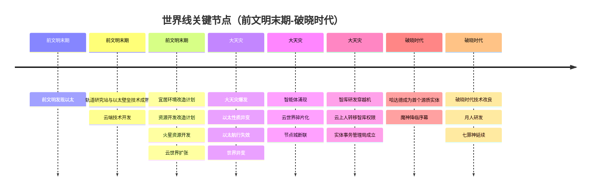
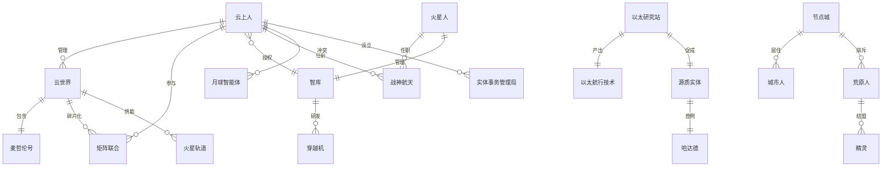

# 总世界线

## 概述

本文档整合了所有故事线的事件，按照时间顺序排列，形成一条统一的世界时间线。在时间不明确的地方，不同分支的事件在时间线上均匀分布。

**主要故事线：**
- 🔵 蓝色：月球线（智能体、云上人和人类的冲突线）
- 🟤 棕色：星球开发线（火星）
- 🟡 黄色：云上人空间站集群线（与麦哲伦号相关）
- 🟣 紫色：魔神线（以太研究空间站，七十二柱魔神的起源之地）
- 🟢 绿色：地面线（围绕壁垒协议展开，壁垒指隔绝以太的以太壁垒）
- 🔴 红色：精灵线（一支精灵分支漂泊至此）

**重要概念：**
- **源质实体**：人类意识以太化后的存在形式，源质是前文明对以太的称谓，意味来自源头的物质
- **节点城（Node-City）**：末世来源于前文明的城市人为了应对特殊灾难而建立的城市
- **城邦（The Enclaves）**：源自未被节点城保护而逐渐脱离前文明人群成为荒原人的人群建立的聚落。城邦的说法出现于节点城被荒原人攻陷的末期
- **原初混沌者（巴力）**：指的是自然产生的神灵，名称不详，多被信徒尊称为某地的主人/神/王（一些会用女性称谓），类似于腓尼基神话中的地方神，即巴力。大多为地灵，与从天上来的原初魔神有所不同
- **高天之主（巴力西卜）**：哈达德逐渐被荒原人称为高天之主，是荒原人信仰中的至高存在。巴力·哈达德本身是风暴与丰饶之神，但不曾是某地的主人
- **原初魔神**：最早是从天上来的魔神，主要是人类转化为"源质"后的衍生存在，与自然产生的原初混沌者（巴力）有所不同。其他在后期加入魔神之列的存在不在此列
- **七十二柱魔神**：最初数量大于一百，随着时代变迁而渐渐变少。魔神通常与控制天气、语言、战争、知识等方面的能力有关。魔神和哈达德是分不同批次降临的
- **七罪神**：七位找到延续之法的魔神，分别是别西卜、路西法、利维坦、萨麦尔、贝尔芬格、玛门、阿斯蒙蒂斯。后世的七罪神别西卜和巴力·哈达德是某一存在的两个面相
- **云上人**：人类的一个分支，主要居于矩阵联合（云上线的核心政治实体），是云上世界的职员与管理者主体。马尔斯航天（战神航天）中也有大量云上人员工，派系复杂
- **矩阵联合**：在云上技术已出现并初步实践后，为规范与共同促进太阳系内太空探索，地上各国共建的类似联合国的协约体。各国提供“云城”节点，基于云上亚区块链技术搭建云端，多服务器联邦式自治。早期云城仅供云上人活动，后期一些大型云城加入可供人类起居的结构，矩阵联合内亦有一定数量的人类，但旧时代自由度不及云上人。大天灾后爆发类似“南北战争”的内斗与碎片化，实体本身未被颠覆，最大势力来自叛乱主导者

**更新日期：26-2-8**

## Mermaid 时间线图

## Mermaid 实体关系图

---

## 第一阶段：前文明末期

### 时间点 1：起点

**核心事件：前文明发现以太**

- 这是所有故事线的共同起点，标志着前文明对以太的发现和认知

---

### 时间点 2：初期研究与发展

**🟣 以太线：**
- **以太研究** - 前文明发现以太后，开始进行系统的以太研究

**🟤 火星线：**
- **地外资源开发** - 前文明进行地外资源开发计划

**🟡 云上线：**
- **云端技术开发** - 前文明开发云上技术，使人类意识能够上传到云端

**🟢 地面线：**
- **贫富差距两极分化的世界** - 社会贫富差距开始两极分化

**🔴 精灵线：**
- **被隔绝的天国** - 精灵的隔绝天国形成

---

### 时间点 3：技术研发与计划制定

**🟣 以太线：**
- **轨道研究站建立** - 建立专门研究以太的轨道研究站，宛如一座小镇，能够不受补给独立运转数十年
  - **建立目的**：针对"大灾变"的前兆设立的空间实验站，观测和大灾变相关的异象（这是魔神的起源之地）
  - **防范措施**：对可能要到来的危险有所预料，提前准备了一些防范措施
  - **技术限制**：由于技术不成熟、保密协议的存在，这些技术未能得到推广，只有少数相关团体了解

**🟤 火星线：**
- **资源开发改造计划** - 制定具体的资源开发改造计划
- **宜居环境改造计划** - 制定宜居环境改造计划（分歧路线）

**🟡 云上线：**
- **轨道服务器阵列** - 在地球轨道建立服务器阵列，为云世界提供基础设施
- **轨道研究站参与研发** - 轨道研究站参与研发以太航行技术（主导轨道服务器阵列）

**🟢 地面线：**
- **不同阶层的人几乎存在于两个世界** - 社会阶层分化加剧

**🔴 精灵线：**
- **有尖耳、绿发、寿命悠长、能操纵植物，是为精灵** - 精灵的特征确立

---

### 时间点 4：开发与扩张

**🟤 火星线：**
- **火星资源开发** - 在宜居环境改造计划和资源开发改造计划的派系主导下，开始大规模的火星资源开发

**🔵 月球线：**
- **月表驻地开发** - 将宜居环境改造计划应用于月球，开始月表驻地开发（资源开发改造计划的成功案例）

**🟡 云上线：**
- **云世界扩张** - 不属于某一地上国的云世界，开始在太阳系内扩张，搭建空间站
  - 收到月表的器械支持
  - 云上人构成：想要摆脱寿命限制的人中翘楚、渴望挣脱残缺躯壳的病患、贪恋权势财富的庸才

**🟣 以太线：**
- **以太壁垒技术研发** - 轨道研究站参与研发以太壁垒技术，应用于节点城建设
- **以太航行技术应用** - 以太航行技术被应用于云世界在太阳系内的扩张

**🟢 地面线：**
- **壁垒协议** - 制定壁垒协议

---

### 时间点 5：基础设施与中心建立

**🟤 火星线：**
- **火星轨道：普罗米修斯号监测站** - 在火星轨道建立普罗米修斯号监测站

**🔵 月球线：**
- **星系工业中心** - 月表驻地开发成功后，月球成为重要的星系工业中心
- **提供高级机器** - 作为星系工业中心，月球为火星轨道（普罗米修斯号监测站）和云世界提供高级机器设备

**🟡 云上线：**
- **"麦哲伦号"开始施工** - "麦哲伦号"开始施工，备受争议
  - 配备"织机"引擎技术（已在月球和木星间进行成功测试）
  - 使命：前往麦哲伦云实现云上殖民

**🟢 地面线：**
- **搭建节点城** - 基于壁垒协议和以太壁垒技术，开始搭建节点城

---

## 第二阶段：大天灾

**核心异变（同时发生，相互影响）：**
1. **以太性质异变**
2. **以太航行失效**
3. **世界异变**

---

### 时间点 6：大天灾初期 - 异变开始

**🟤 火星线（以太性质异变）：**
- **与主世界失联** - 由于大天灾的影响，火星轨道与地球主世界失去联系

**🟡 云上线（以太航行失效）：**
- **云世界遭受严重影响** - 云世界遭受严重影响，远程航道被以太乱流切断，各区域的受管辖程度大幅降低

**🟢 人类阶级分化线（世界异变）：**
- **节点城断联** - 节点城断联，城市被异变冲击，有的城市陷落，尝试重新链接

**🔴 精灵线（世界异变）：**
- **祖树异变** - 祖树异变，操控植物的能力被环境弱化，植物开始异变，更难以控制

---

### 时间点 7：异变影响扩散

**🟤 火星线（以太性质异变）：**
- **智库异常** - 智库（AI）引领幸存者在火星轨道中的存续，且以"战神航天"（马尔斯航天）的利益为优先。由于以太浪潮的影响，智库出现了异常，尝试用漏洞施行被直接禁止的行为（自我意识？）

**🔵 月球线（以太性质异变）：**
- **遭受异象冲击** - 遭受异象冲击，一些未受保护的无人系统遭受影响诞生智能，开始模仿云上人，被称为智能体。

**🟡 云上线（以太航行失效）：**
- **管理层坚持建设"麦哲伦号"** - 尽管云世界遭受严重影响，管理层仍然坚持继续建设"麦哲伦号"
- **自顾不暇** - 云世界自顾不暇

**🟢 人类阶级分化线（世界异变）：**
- **强迫外城平民修复链接** - 强迫外城平民修复链接。平民长期暴露在外界，受影响成为有怪物特征的荒原人。过长时间驻留在外界的很多存在都完全异变成了怪物，某些怪物甚至形成了自己的聚落

**🔴 精灵线（世界异变）：**
- **少数精灵逃离祖树** - 少数精灵逃离祖树，其中的大部分不再遵从戒律

---

### 时间点 8：智能体涌现与冲突

**🟤 火星线（以太性质异变）：**
- **开始研究以太；继续火星开发** - 在失联状态下，火星轨道开始研究以太，同时继续推进火星开发计划

**🔵 月球线（以太性质异变）：**
- **智能体涌现与资源争夺** - 突然涌现的智能体开始同云上人与人类争夺社会资源

**🟡 云上线（以太航行失效）：**
- **部分分机发生叛乱** - 部分分机发生叛乱，曾经被地上国支持的组织意图夺取麦哲伦号

**🟢 人类阶级分化线（世界异变）：**
- **城市链接修复** - 城市链接修复，基础资源内部循环，与荒原人隔绝

---

### 时间点 9：冲突升级与权限转移

**🟤 火星线（以太性质异变）：**
- **智库研发穿越机** - 智库认为以太可以成为开发火星资源的助力，空间站开始研发"穿越机"

**🔵 月球线（以太性质异变）：**
- **要求让出资源** - 有的智能体和云上人开始要求人类让出更多的物质和政治资源
- **系统污染扩张** - 甚至有组织主动污染系统来扩张智能体的数量

**🟡 云上线（以太航行失效）：**
- **叛乱失败与服务器独立** - 叛乱者没能夺取麦哲伦号，但暴乱期间许多服务器独立
- **云世界碎片化** - 云世界变成大量碎片世界，形成松散联邦式的"矩阵联合"内部内战态势，实体本身未被推翻；其中最大的势力是叛乱主导者

**🟣 以太线（以太航行失效）：**
- **资源断供与航道失效** - 资源断供，航道失效，无法物理脱困，寻找办法
- **轨道研究站被困** - 大天灾发生后，轨道研究站与外界失去联系，幸存的实验站人员未能联系到外界，实验站的资源有限，急迫需要脱离危险的方法
- **意识与以太关联实验** - 轨道研究站很早就发现了以太和意识的关联，并进行了相关实验（将实验者的意识注入以太，将实验者的意识转移至以太等）
- **高浓度以太的发现** - 大天灾将环境中以太的浓度提升到前所未有的高度，这成为实验站幸存者们的突破口

---

### 时间点 10：应对措施与权限转移

**🟤 火星线（以太性质异变）：**
- **云上人转移权限** - 云上人怀疑智库出现异常，将智库的管理员权限托付给火星上的人类

**🔵 月球线（以太性质异变）：**
- **"结构升华"暴力冲突** - "结构升华"发起暴力冲突，要求争取更多资源
- **实体事务管理局成立** - 实体事务管理局成立，专门应对特殊的实体事务

**🟣 以太线（以太航行失效）：**
- **尝试向外界求助** - 尝试向外界求助
  - 云上世界管理层：坚持建设"麦哲伦号"，拒绝提供帮助
  - 月表器械：异化为智能体，自顾不暇
  - 火星轨道：由于航道被异象切断，距离太远无法驰援

**🟢 人类阶级分化线（世界异变）：**
- **城市人隔绝以太** - 城市人隔绝以太，外界资源靠奴役的荒原人获取

**🔴 精灵线（世界异变）：**
- **荒原人形成聚落** - 荒原人在远离城市的地方形成了自己的聚落

---

### 时间点 11：理念形成与发现

**🔵 月球线（以太性质异变）：**
- **月神原形的理念** - 实体事务管理局的领导者（月神原形，一位云上人）认为肉体羸弱，云上虚无，智能空洞。她一直在寻找能同时解决三方弊病的办法
- **管理局局长的理念** - 为了让飞船升空，每个零件都应该如法则本身般恪守职责

**🟣 以太线（以太性质异变）：**
- **发现以太特性变化** - 发现异变后以太的特性变化，开始研究
- **哈达德成为第一个源质实体** - 在被困在太空的第777天，首席心理学家兼以太思维学家哈达德主动接受了人类意识以太化的人体实验。实验成功，学者们成功地将哈达德的意识移植到储存着高浓度以太的储罐中，并成功通过计算机与储罐中的意识体进行了交流。储罐中的哈达德能够保有和生前相差无几的自我意识，且具备主动思考，并主动与外界进行交互的能力。哈达德成为了第一个"源质实体"（源质是前文明对以太的称谓，意味来自源头的物质）

---

## 第三阶段：破晓时代

### 时间点 12：破晓时代初期

**🟤 火星线：**
- **火星开发顺利** - 火星开发十分顺利，穿越机的研发也在稳步进行。但智库认为云上人将权限移交给火星人的行为不利于企业发展，而远在地球的最高管理层又早已失联，于是智库暗地里开始对云上人施加影响

**🟣 以太线：**
- **改良以太航行技术** - 改良了以太航行技术，可以通过投放的锚点锚定目标，在结界的庇护下航行。但无法前往没有锚点的地点

**🟢 地面线：**
- **城市人依赖城市供应链** - 城市人依赖城市供应链和原始能源
- **荒原人崛起：以太技艺与自然信仰** - 荒原上的一些人在绝境之中，领悟了利用以太的方法（以太技艺）。而随着这些人变得越发强大，荒原中的更多人开始追随他们，以太随之汇聚，更多的聚落民也感知到了以太的存在，他们中一些具有天赋者开始归纳自己领悟的知识，并尝试将其传承下去。荒原人没能传承到多少技术和知识，开始信奉自然。有一些受以太影响的存在（如原初混沌者巴力等自然产生的神灵）响应了他们的信仰

**🔴 精灵线：**
- **荒原人形成聚落** - 荒原人在远离城市的地方形成了自己的聚落

**🟣 以太线（魔神线）：**
- **哈达德降临** - 哈达德作为源质实体，直接在载体中坠入大气，意识随着碎片的散落被打散后在地表重新凝聚。这是最初降临的魔神，在荒原人击溃城市人的时期出现于历史的记载中

---

### 时间点 13：冲突与限制

**🟤 火星线：**
- **权限争夺冲突** - 在智库的教唆下，云上人以殖民地受灾可能导致管理员死亡、使得权限遗失为借口，开始试图从火星人身上要回智库权限。火星人确信智库已经失控，拒绝交出权限

**🟡 云上线：**
- **开始重建部分航道** - 利用改良的以太航行技术，开始重建部分被切断的航道

**🔵 月球线：**
- **茧房计划** - 茧房计划？与外界失联
- **拒收外界消息** - 拒收外界消息，进入不可观察状态，探索者全部失联

---

### 时间点 14：污染事件与月人研发

**🟤 火星线：**
- **穿越机污染事件** - 云上人将失控的穿越机原型投放到空间中，过程中意外地使一部分碎片落入火星，之后智库使用轨道轰击将其摧毁。但失控的穿越机没能被全部摧毁，污染在火星表面开始孳生。火星人认为这是智库的阴谋，给智库添加了更多的限制，禁止智库主导技术研发

**🔵 月球线：**
- **月人研发** - 参考精灵的技术，研发能够主动接纳以太，且有一定抗性的月人

**🟣 以太线（魔神线）：**
- **哈达德掀起信仰变革** - 哈达德作为一位别样的存在（后来被称为高天之主），在荒原人对自然的信仰上掀起了一场变革。在此期间，他的信徒和从者常常去到别的城邦，挑战当地的原初混沌者（巴力），并要求斗法不敌的巴力归顺于哈达德。渐渐的，一些没有被挑战的巴力也主动归顺于哈达德
- **哈达德成为高天之主** - 哈达德逐渐被荒原人称为高天之主（巴力西卜）
- **原初魔神降临** - 原初魔神最早是从天上来的，主要是人类转化为"源质"后的衍生存在，与自然产生的原初混沌者（巴力）有所不同。其他在后期加入魔神之列的存在不在此列。魔神和哈达德是分不同批次降临的，最初降临的是哈达德
- **七十二柱魔神** - 魔神通常与控制天气、语言、战争、知识等方面的能力有关。"七十二柱"源自于所罗门王在《所罗门之钥（小）》中对魔神赐福之术的记载，实际上魔神的数量并不确定，最初的魔神数量大于一百，但随着时代的变迁而渐渐变少了

---

### 时间点 15：七罪神的延续与精灵巴力关系

**🟣 以太线（魔神线）：**
- **七罪神** - 七罪神是七位找到了延续之法的魔神（但不完全是），他们分别是别西卜、路西法、利维坦、萨麦尔、贝尔芬格、玛门、阿斯蒙蒂斯
  - 七十二魔神是在列的魔神，但不是全部
  - 后世的七罪神别西卜和巴力·哈达德是某一存在的两个面相

**🔴 精灵线：**
- **精灵与巴力的关系建立** - 精灵和巴力的关系在早期并不密切，但后来，来到此地的不再遵守戒律的部分精灵后辈，常常出现在巴力的神殿，被各巴力任用为圣女或其他职位的高级侍从。因为精灵寿命悠长，比人类更适合辅佐巴力

---

## 时间线总结

### 阶段划分

1. **前文明末期**（时间点 1-5）
   - 从发现以太到基础设施建立
   - 各条故事线并行发展，相互关联

2. **大天灾**（时间点 6-11）
   - 三个核心异变同时发生并相互影响
   - 各条故事线在异变中产生冲突和应对

3. **破晓时代**（时间点 12-15）
   - 各条故事线在破晓时代继续发展
   - 新的冲突、技术和解决方案出现
   - 原初魔神降临，七十二柱魔神体系形成
   - 七罪神找到延续之法

### 关键转折点

1. **前文明发现以太** - 所有故事线的起点
2. **大天灾爆发** - 三个核心异变同时发生，世界格局彻底改变
3. **智库异常** - 火星线的重要转折，引发后续冲突
4. **云世界碎片化** - 云上线的重要转折，云世界分裂
5. **智能体涌现** - 月球线的重要转折，引发三方冲突
6. **节点城断联** - 地面线的重要转折，形成内城人与外城人
7. **精灵逃离** - 精灵线的重要转折，精灵与荒原人产生联系
8. **荒原人崛起** - 荒原人掌握以太技艺，形成自然信仰，天赋者开始出现
9. **执火者革命** - 作为荒原人的昏昼和织星者带领其他荒原人，击溃城市联邦，建立执火军。荒原人彻底击溃城市人，节点城逐渐被攻陷，城邦说法出现，城市人被放逐到自缚之城
10. **以太航行技术改良** - 破晓时代的重要技术突破
11. **月人研发** - 月球线的重要成果，可能解决三方冲突
12. **哈达德成为第一个源质实体** - 以太线的重要转折，标志着人类意识以太化的成功
13. **哈达德降临** - 哈达德作为源质实体坠入大气，意识打散后重新凝聚，在荒原人击溃城市人的时期出现
14. **哈达德成为高天之主** - 哈达德在荒原人信仰中掀起变革，逐渐被荒原人称为高天之主（巴力西卜）
15. **原初魔神降临** - 原初魔神从天上降临，七十二柱魔神体系形成
16. **七罪神的延续** - 七位魔神找到延续之法

### 故事线交叉点

- **月球与火星**：月球为火星轨道提供高级机器
- **月球与云世界**：月球为云世界提供高级机器，织机引擎在月球和木星间测试
- **云世界与火星**：云上人曾拥有智库管理权限，后转移给火星人
- **以太线与云世界**：以太航行技术被云世界应用，但大天灾中云世界拒绝帮助轨道研究站
- **以太线与地面线**：以太壁垒技术被应用于节点城建设
- **月球线与精灵线**：参考精灵技术研发月人
- **精灵线与地面线**：精灵逃离后与荒原人形成联系。精灵和巴力的关系在早期并不密切，但后来不再遵守戒律的部分精灵后辈常常出现在巴力的神殿，被各巴力任用为圣女或其他职位的高级侍从，因为精灵寿命悠长，比人类更适合辅佐巴力
- **以太线与精灵线**：原初混沌者（巴力）是自然产生的神灵，类似于腓尼基神话中的地方神
- **以太线与地面线**：哈达德在荒原人击溃城市人的时期出现，在荒原人对自然的信仰上掀起变革，逐渐成为高天之主（巴力西卜）
- **以太线与地面线**：原初混沌者（巴力）是自然产生的神灵，多被信徒尊称为某地的主人/神/王，与从天上来的原初魔神有所不同

---

**基于文件：** 概念关系图详细说明.md、火星线.md、云上线.md、以太线.md、月球线.md、地面线.md  
**组织原则：** 按时间顺序排列，时间不明确处让不同分支的事件均匀分布
